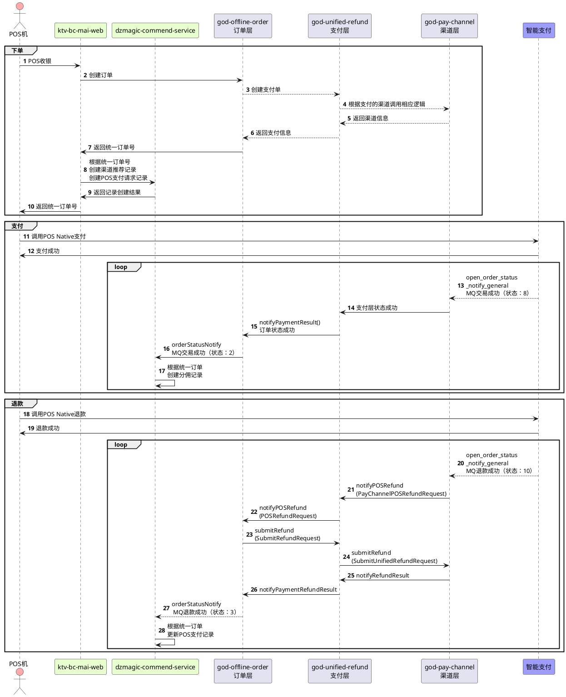

# 【GOD-Offline】POS收银订单系统交互

```plantuml
@startuml
actor POS机 as pos #FFAAAA
participant "ktv-bc-mai-web" as bu #E8FED0
participant "dzmagic-commend-service" as magic #E8FED0

participant "god-offline-order\n订单层" as order
participant "god-unified-refund\n支付层" as pay
participant "god-pay-channel\n渠道层" as channel
participant 智能支付 as zc #9E9DFB

autonumber

group 下单
    pos -> bu: POS收银
    bu ->  order : 创建订单
    order --> pay: 创建支付单
    pay -->channel: 根据支付的渠道调用相应逻辑
    channel-->pay: 返回渠道信息
    pay-->order: 返回支付信息
    order -> bu : 返回统一订单号
    bu -> magic : 根据统一订单号\n创建渠道推荐记录\n创建POS支付请求记录
    magic -> bu : 返回记录创建结果
    bu->pos : 返回统一订单号

end

group 支付
pos ->zc : 调用POS Native支付
zc -> pos : 支付成功
loop
    zc --> channel : open_order_status\n_notify_general\nMQ交易成功（状态：8）
    channel -> pay : 支付层状态成功
    pay -> order : notifyPaymentResult()\n订单状态成功
    order -> magic :orderStatusNotify\nMQ交易成功（状态：2）
    magic -> magic :根据统一订单\n创建分佣记录
end
end

group 退款
pos ->zc : 调用POS Native退款
zc -> pos : 退款成功
loop
    zc --> channel : open_order_status\n_notify_general\nMQ退款成功（状态：10）
    channel -> pay : notifyPOSRefund\n(PayChannelPOSRefundRequest)
    pay -> order:notifyPOSRefund\n(POSRefundRequest)
    order -> pay:submitRefund\n(SubmitRefundRequest)
    pay -> channel : submitRefund\n(SubmitUnifiedRefundRequest)
    channel -> pay : notifyRefundResult
    pay->order : notifyPaymentRefundResult
    order --> magic :orderStatusNotify\n MQ退款成功（状态：3）
    magic -> magic :根据统一订单\n更新POS支付记录
end
end
@enduml
```